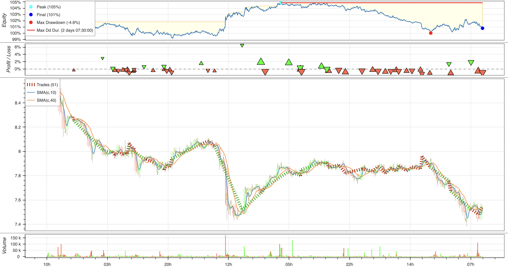

# Trading Strategies

```python

from emp_orderly import EmpOrderly, Strategy
from emp_orderly_types import *

# define a trading strategy.  The only method necessary is the next method,
# which can access the current/historical prices and make buy/sell orders and limit orders.
class SmaCross(Strategy):
    n1: int = 10
    n2: int = 40

    @classmethod
    def update_lags(cls, n1, n2):
        cls.n1 = n1
        cls.n2 = n2

    def init(self):
        close = self.data.close
        self.sma1 = self.I(SMA, close, self.n1)
        self.sma2 = self.I(SMA, close, self.n2)

    def next(self):
        # self.data: access the current OHLCV
        # self.position: Position

        if crossover(self.sma1, self.sma2):
            self.position.close()
            self.buy(size=0.5)
        elif crossover(self.sma2, self.sma1):
            self.position.close()
            self.sell(size=0.5)


# next we can create a new instance of EmpOrderly with an initial amount of cash and a commission
emp_orderly = EmpOrderly(
    cash=1000,
    commission=.0001,
    exclusive_orders=True,
    sdk=EmpyrealOrderlySDK(pvt_hex=pvt_hex, account_id=orderly_id, is_testnet=True),
)

# Then we can load the strategy to the SDK, and load historical data to use for backtesting
emp_orderly.set_strategy(SmaCross)
await emp_orderly.load_data(
    lookback=5,
    interval=Interval.five_minute,
    asset=PerpetualAssetType.APT,
)

# backtest
emp_orderly.backtest()

# plot
emp_orderly.plot(show_price_data=False)
plt.show()
```

# Output

This output of the strategy plot shows the profit a few important metrics:
    - the profit/loss of the strategy
    - when trades are made
    - profitability of the strategy overlaid on the movement of the asset's price


